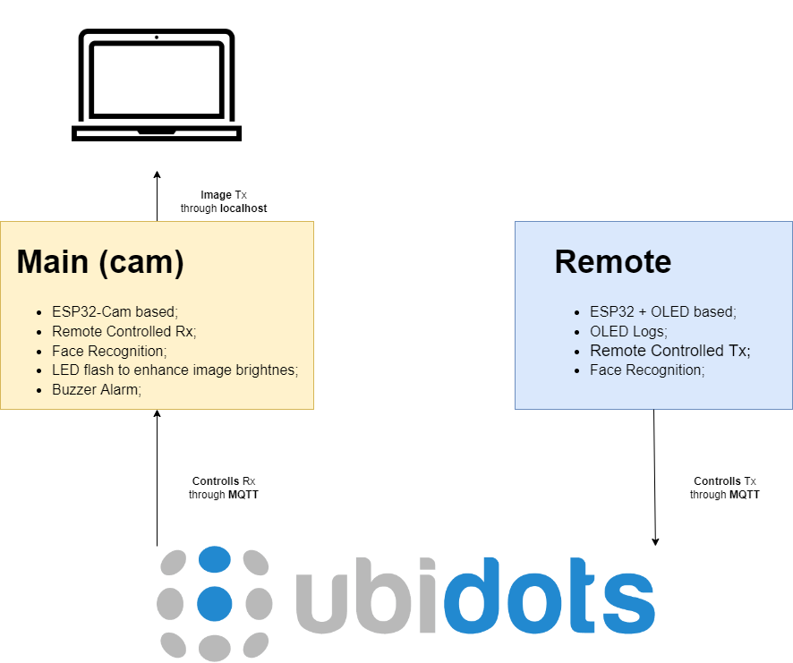

# Orwell Project Software

   

<p style="text-align:center">
  

  
</p>
> The Orwell Project is made to reproduce the simple idea of controlling a camera wirelessly. Above, we have bigger details;

## 🛠️ Fixes and Enhancements
The project is been developed, and the next updates needed are:
- [ ] Organize the repo; 
- [ ] Update README.md
- [ ] Make the MQTT remote control Tx;
- [ ] Make the MQTT remote control Rx;

---
## 💻 Prerequisites
Before start, check if you have the materials we need for each module:
### 👓 Main (Cam)
<!--List all the components needed for this module>-->

### 🕹 Remote Controll
<!--List all the components needed for this module>-->

---
## 📁 Files Structure
The project is strutctured as described bellow:
```
├───data        -> Storage the data to be analyzed, it will be ignored in repo
│ └───src         ->
├───docs        -> Files about documentation of the project
├───models      -> Pickle models are stored here
├───notebooks   -> Experiments are here
└───src         -> Sucessfull experiments modularized in .py files
```
